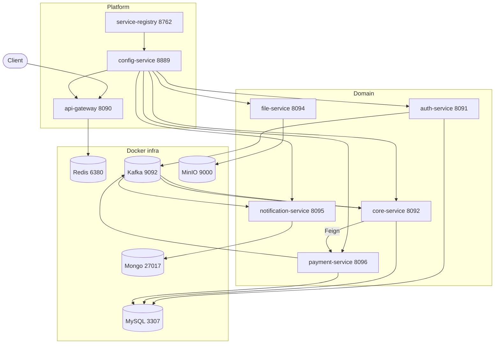
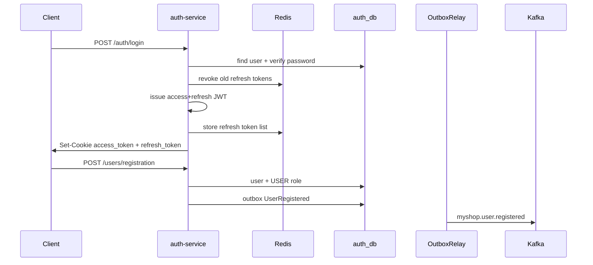
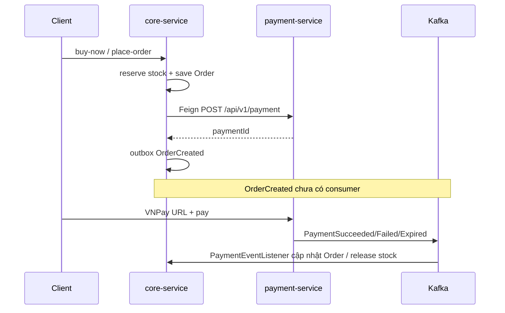

# Giải thích chi tiết từng service MyShop

Tài liệu đi theo **thứ tự chạy thật** của hệ thống. Mỗi service: vai trò → pom → cấu hình → lớp chính → business logic → liên kết với service khác.

> Cập nhật theo codebase hiện tại: `commons` là **một** module jar (packages `constants` / `dto` / `events` / `exception` / `security`); lỗi nghiệp vụ dùng `BusinessException` + `ErrorCodeSpec`.



---

## 0. Nền tảng chung

### Parent POM — [`pom.xml`](pom.xml)
- Spring Boot **3.3.5**, Spring Cloud **2023.0.3**, Java **17**
- Modules: `commons`, `service-registry`, `config-service`, `api-gateway`, `auth` / `file` / `notification` / `core` / `payment`
- Dependency management: artifact `commons`, MyBatis, SpringDoc

### Commons — [`commons/`](commons/) (một jar, chia package)
| Package | Vai trò |
|---|---|
| `constants` | `ApiPrefixes`, `JwtConstants`, `SecurityConstants` (cookie, swagger whitelist) |
| `dto` | Envelope `ApiResponse<T>` |
| `events` | `UserRegisteredEvent`, `OrderCreatedEvent`, `Payment*Event`, `DomainEventType` |
| `exception` | `BusinessException`, `ErrorCode` (generic), `ErrorCodeSpec`, i18n `messages*` + `MessageConfig` |
| `security` | `FeignClientAutoConfiguration` (optional) |

Domain-only (messages / auth error codes / Redis keys / roles / Kafka group) nằm **trong từng service**, không còn trong commons.

### Docker Compose — [`docker-compose.yml`](docker-compose.yml)
| Infra | Host port | Dùng bởi |
|---|---|---|
| MySQL | 3307 | `auth_db`, `core_db`, `payment_db` |
| Redis | 6380 | Gateway rate-limit, auth blacklist, core cache |
| Kafka | 9092 | Events auth / core / payment / notification |
| MinIO | 9000 / 9001 | file-service |
| MongoDB | 27017 | notification-service |

### Pattern cấu hình domain service
1. Local bootstrap `application.yml`: `port`, `spring.config.import: optional:configserver:http://localhost:8889`, Eureka `8762`
2. Config Server: `config/{service}/{service}.yml` + `{service}-dev.yml` + `config-dev.commons/application.yml` (Redis / Kafka / Eureka / `api.prefix`)
3. Config Server **ghi đè** local cùng key → đổi port phải sửa local + config-service và **restart config-service**

### Pattern Outbox (auth, core, payment)
```
Business TX → INSERT outbox (published=false)
OutboxRelay @Scheduled (~1s) → KafkaTemplate.send → mark published=true
```

### API prefix
- YAML: `api.prefix` trong `config-*.commons` → gateway routes `${api.prefix}/...`
- Java: `ApiPrefixes.V1` trong commons

---

## 1. `service-registry` (Eureka) — **8762**

**Vai trò:** Service discovery. Gateway / Feign dùng `lb://service-name`.

**Pom:** `eureka-server` + actuator. Không Config Client.

**Config:** [`service-registry/.../application.yml`](service-registry/src/main/resources/application.yml)
- `register-with-eureka: false`, `fetch-registry: false`
- `enable-self-preservation: false` (dev)

**Code:** [`ServiceRegistryApplication`](service-registry/src/main/java/com/myshop/registry/ServiceRegistryApplication.java) + `@EnableEurekaServer`.

**Chạy đầu tiên.**

---

## 2. `config-service` — **8889**

**Vai trò:** Central config (native classpath).

**Pom:** `config-server` + Eureka client + actuator.

**Config:** [`config-service/.../application.yml`](config-service/src/main/resources/application.yml)
```yaml
spring.profiles.active: native
spring.cloud.config.server.native.search-locations:
  classpath:/config/{application},classpath:/config-{profile}.commons
```

**Resolve** (`auth-service` + profile `dev`):
1. `config/auth-service/auth-service.yml`
2. `config/auth-service/auth-service-dev.yml`
3. `config-dev.commons/application.yml`

**Code:** [`ConfigServiceApplication`](config-service/src/main/java/com/myshop/config/ConfigServiceApplication.java) + `@EnableConfigServer`.

**Chạy thứ hai** (sau Eureka). `optional:configserver:` cho phép boot khi Config down (thiếu DB/Kafka settings).

---

## 3. `api-gateway` — **8090**

**Vai trò:** Entry point: route, CORS, JWT, Redis rate-limit.

**Pom:** Gateway (WebFlux), Eureka, LoadBalancer, Config, Redis reactive, Security + OAuth2 RS, `commons`.

**Routes** — [`api-gateway-dev.yml`](config-service/src/main/resources/config/api-gateway/api-gateway-dev.yml):

| Route id | `lb://` | Path |
|---|---|---|
| auth | auth-service | `${api.prefix}/auth/**`, `/users/**`, `/admin/**` |
| file | file-service | `${api.prefix}/files/**`, `/images/**` |
| notification | notification-service | `${api.prefix}/notifications/**` |
| payment | payment-service | `${api.prefix}/payment/**` |
| core | core-service | `${api.prefix}/**` (catch-all, **cuối**) |

Default filter: `RequestRateLimiter` 50/s, burst 100, key = IP ([`RateLimiterConfig`](api-gateway/src/main/java/com/myshop/gateway/config/RateLimiterConfig.java)).

**Security:** [`GatewaySecurityConfig`](api-gateway/src/main/java/com/myshop/gateway/config/GatewaySecurityConfig.java) — permitAll login/register/catalog/files/VNPay callback; còn lại JWT HS256 (`myshop.security.jwt.secret` khớp auth).

**Swagger:** từng service (8091–8096), không aggregate qua gateway.

**Chạy cuối** (sau domain + Redis).

---

## 4. `auth-service` — **8091**

**Vai trò:** Identity — user/role/permission, JWT cookie, OTP, publish `UserRegistered`.

**Pom:** Web, JPA, MyBatis, Redis, Security + OAuth2 RS, Mail, Kafka, Eureka, Config, MySQL, Nimbus, Google client, SpringDoc, `commons`.

**Config-dev:** MySQL `auth_db@3307`, Redis, Kafka, mail, JWT, outbox.

**Security:** [`SecurityConfig`](auth-service/src/main/java/com/myshop/auth/config/SecurityConfig.java)
- Public: `/api/v1/auth/**`, `/users/registration`, actuator, Swagger
- Cookie `access_token` ([`CookieBearerTokenResolver`](auth-service/src/main/java/com/myshop/auth/config/CookieBearerTokenResolver.java)) hoặc Bearer
- HS256 [`CustomJwtDecoder`](auth-service/src/main/java/com/myshop/auth/config/CustomJwtDecoder.java)
- Authorities: claim `permissions` hoặc `scope` (`ROLE_*`)

**Flows** ([`AuthenticationService`](auth-service/src/main/java/com/myshop/auth/service/AuthenticationService.java)):



| API | Logic |
|---|---|
| Login / Google | Verify → `issueTokens` → HttpOnly cookies (`SameSite=Strict`) |
| Refresh | Refresh cookie + Redis blacklist → new access cookie |
| Logout | Blacklist refresh → clear cookies |
| Register | User + role USER + outbox (không set cookie) |
| Forgot / Reset | OTP 6 số / 5 phút → email → đổi password |

**Outbox:** [`UserRegisteredEventPublisher`](auth-service/src/main/java/com/myshop/auth/service/UserRegisteredEventPublisher.java) → [`OutboxRelay`](auth-service/src/main/java/com/myshop/auth/outbox/OutboxRelay.java) → `myshop.user.registered`.

**Domain local:** `AuthMessageKeys`, `RoleConstants`, `RedisKeyConstants`, `messages-auth*.properties`. Auth business errors use `BusinessException(message)` only; token/auth protocol errors still use commons `ErrorCode` (`TOKEN_REVOKED`, `UNAUTHENTICATED`, `TOKEN_EXPIRED`).

**Persistence:** JPA `ddl-auto: update`; MyBatis permission/user list. Seeder: `ADMIN` + `admin@gmail.com` / `Admin@123` (role `USER` cần có trong DB để register).

---

## 5. `core-service` — **8092**

**Vai trò:** Commerce — catalog, inventory, cart, order, profile, coupon, review, report.

**Pom:** như auth + **OpenFeign** + MyBatis report/product. DB `core_db`.

**Security:** GET products/categories public; còn lại JWT.

**Order flow** ([`OrderService`](core-service/src/main/java/com/myshop/core/service/order/OrderService.java)):



- **buy-now:** 1 SP + địa chỉ → reserve → order → Feign payment → outbox `OrderCreated`
- **place-order:** từ cart → tương tự → clear cart
- **cancel:** release stock nếu chưa shipped/delivered

**Kafka:**
- `UserRegisteredListener` → `UserProfile` + Cart trống
- `PaymentEventListener` → succeeded: CREATED→PENDING; expired: CANCELLED + release stock

**Feign:** `PaymentServiceClient` (đang dùng); `FileServiceClient` (khai báo, chưa gắn ProductService).

**Domain local:** `CoreEnums`, `CoreMessageKeys`, `CoreKafkaConstants`, `messages-core*.properties`.

---

## 6. `payment-service` — **8096**

**Vai trò:** Payment record, VNPay, COD, expiry; emit events.

**Pom:** Web, JPA, Security, Kafka, Eureka, Config, MySQL. **Không Feign.**

**Security:** public `GET /vn-pay-callback`.

**Flows** ([`PaymentService`](payment-service/src/main/java/com/myshop/payment/service/PaymentService.java)):
1. **create** (Feign từ core): CASH→UNPAID; online→INIT + `vnpTxnRef` + ~12h
2. **vnpay-url:** HMAC → redirect URL
3. **callback:** verify → PAID / FAILED + event → 302 frontend
4. **confirm-cod:** PAID + succeeded
5. **@Scheduled:** EXPIRED + `PaymentExpiredEvent`

**Outbox → Kafka:** `myshop.payment.succeeded|failed|expired` → core.

**Domain local:** `PaymentEnums`, `PaymentMessageKeys`, `messages-payment*.properties`.

---

## 7. `file-service` — **8094**

**Vai trò:** MinIO facade — upload / presign GET|PUT / delete. **Không DB.**

**Pom:** Web, Security, MinIO SDK, Eureka, Config. Không Kafka/JPA.

**Security:** `GET /api/v1/files/presign` public; upload/delete cần auth.

**Logic:** [`StorageService`](file-service/src/main/java/com/myshop/file/service/StorageService.java) — caller truyền `bucket` + `objectKey` trên mỗi request; file-service chỉ nhận và dùng (auto-create bucket nếu chưa có).

**API params (bắt buộc):** `bucket`, `objectKey` (+ `file` khi upload; `contentType` optional khi presign-upload).

---

## 8. `notification-service` — **8095**

**Vai trò:** Async email + Mongo audit.

**Pom:** Web, MongoDB, Mail, Kafka, Security, Eureka, Config.

**Flow:**
```
Kafka myshop.user.registered
  → UserRegisteredListener
  → NotificationLog (dedupe eventId)
  → welcome email (skip nếu spring.mail.username trống)
```

**API:** `GET /api/v1/notifications`, `GET /{eventId}`.

**Domain local:** `NotificationKafkaConstants`.

---

## 9. Luồng end-to-end

### A. Đăng ký
Client → Gateway → Auth register → outbox → Kafka → **Core** (profile+cart) + **Notification** (email)

### B. Đặt hàng + thanh toán
Client → Gateway → Core order → Feign Payment → VNPay URL → callback → Kafka → Core cập nhật order

### C. Request đã login
Cookie JWT → Gateway validate → `lb://` → service validate lại JWT

---

## 10. Gap hiện tại

- `myshop.order.created` **publish, chưa consumer**
- `FileServiceClient` **chưa inject** vào catalog
- Seeder auth **không tạo role USER** — cần có trong DB để register
- Swagger per service: `http://localhost:809x/swagger-ui/index.html`
- Đổi port: local + config-service YAML + restart Config Server

---

## Thứ tự đọc code đề xuất

1. Infra + Eureka + Config Server  
2. Gateway routes + security  
3. Auth: login cookie + outbox UserRegistered  
4. Core: UserRegistered listener + OrderService + Feign  
5. Payment VNPay + PaymentEventListener  
6. File MinIO, Notification email  

File neo:
- [`README.md`](README.md)
- [`api-gateway-dev.yml`](config-service/src/main/resources/config/api-gateway/api-gateway-dev.yml)
- [`AuthenticationService.java`](auth-service/src/main/java/com/myshop/auth/service/AuthenticationService.java)
- [`OrderService.java`](core-service/src/main/java/com/myshop/core/service/order/OrderService.java)
- [`PaymentService.java`](payment-service/src/main/java/com/myshop/payment/service/PaymentService.java)
